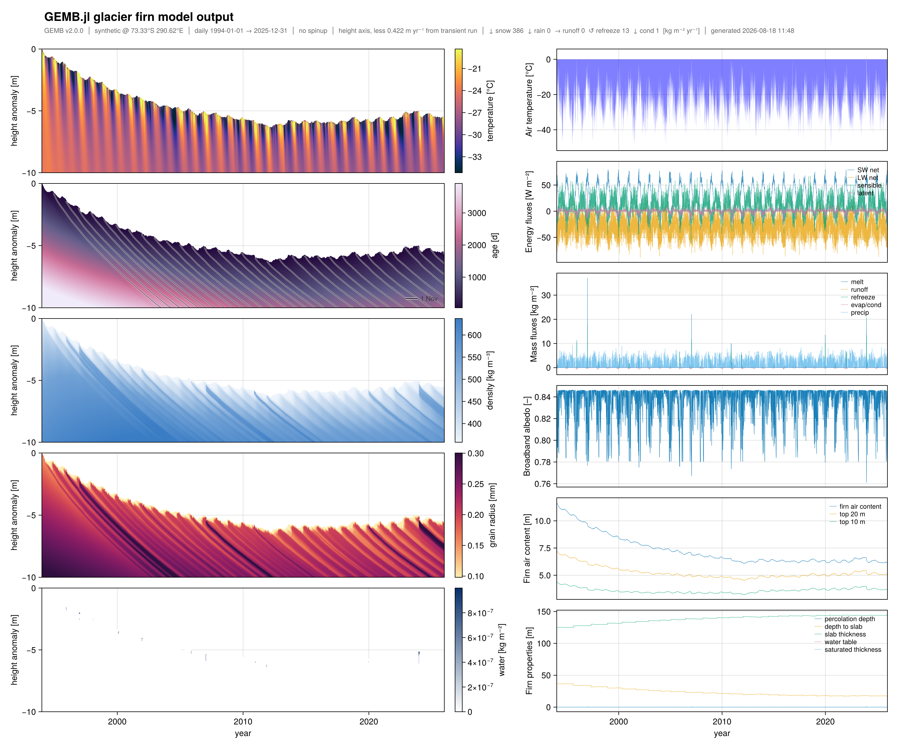
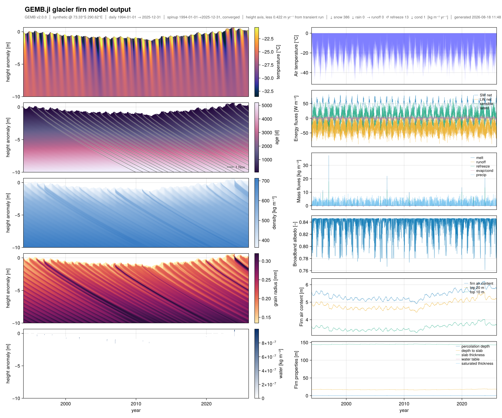

[](https://alex-s-gardner.github.io/GEMB.jl/dev/)
[](https://github.com/alex-s-gardner/GEMB.jl/actions/workflows/CI.yml?query=branch%3Amain)
[](LICENSE)

<!-- Spacer, not decoration: GitHub draws a full-width bottom border on h1, and
     the logo's background is transparent, so a title that sits level with the
     logo shows that rule through the gaps between the grains. These breaks push
     the border clear of the logo's bottom edge. -->
<br><br>

# GEMB.jl: Glacier Energy and Mass Balance Model

GEMB.jl is a Julia implementation of the Glacier Energy and Mass Balance (GEMB, the "B" is
silent) model — a one-dimensional model of the surface energy balance and vertical firn
evolution of glaciers and ice sheets. It couples atmospheric forcing to subsurface
thermodynamics and densification physics to resolve temperature, density, water content,
grain properties, and layer age through the column.

GEMB is a one-dimensional column model with no horizontal communication, prioritizing
computational efficiency to accommodate the multi-millennial spin-ups required to initialize
deep firn columns. It is used for interpreting satellite altimetry, firn and
ice-core studies, surface mass balance inversion, and uncertainty quantification. A complete
description of version 1.0 of the model is given in
[*Gardner et al*., 2023](https://doi.org/10.5194/gmd-16-2277-2023).

GEMB.jl is the reference implementation and is developed independently. It began as a
translation of an earlier MATLAB version; since v2.0.0 its physics, defaults, and numerics
are set on their own merits — against the published literature and against the
[Community Firn Model](https://github.com/UWGlaciology/CommunityFirnModel) and
[IMAU-FDM](https://github.com/IMAU-ice-and-climate/IMAU-FDM). The
[MATLAB version](https://github.com/alex-s-gardner/GEMB) is maintained separately and the two
are no longer expected to agree numerically; departures are recorded under
[Physics notes](https://alex-s-gardner.github.io/GEMB.jl/dev/physics_notes).

## Installation

GEMB.jl is not yet registered in the Julia General registry. Install directly from GitHub:

```julia
using Pkg
Pkg.add(url="https://github.com/alex-s-gardner/GEMB.jl")
```

Climate forcing lives in the companion
[GEMB_ClimateForcing.jl](https://github.com/alex-s-gardner/GEMB_ClimateForcing.jl), also
unregistered. It is optional — GEMB consumes any conforming `DimStack` — but it is what the
examples use, and it is required to run the test suite:

```julia
Pkg.add(url="https://github.com/alex-s-gardner/GEMB_ClimateForcing.jl")
```

Julia ≥ 1.11 is required. A Makie backend (CairoMakie, GLMakie, or WGLMakie) enables
`plot_output`.

## Quick Start

Get forcing, spin the column up to a quasi-steady state, then run it transiently. This is
[`examples/synthetic_example.jl`](examples/synthetic_example.jl) — 32 years of 3-hourly
synthetic forcing, and the run that produced the figures at the bottom of this section:

```julia
using GEMB
using GEMB_ClimateForcing

# 1. Climate forcing — a DimStack, converted to a ClimateForcing. Any conforming
#    DimStack works; GEMB_ClimateForcing is one producer of them.
cf = initialize_forcing(simulate_climate_forcing("test_1", 3))

# 2. Model parameters, validated at construction
mp = initialize_parameters(output_frequency=:daily)

# 3. Spin up on a one-year climatology of the forcing. Deep firn columns need this:
#    a cold start spends decades drifting before the density profile is meaningful.
cf_climatology = forcing_climatology(cf)
profile = initialize_profile(mp, cf_climatology)   # grid is sized to this climate
profile_spunup = gemb_spinup(profile, cf_climatology, mp;
                             max_iterations=400, convergence_delta_density=0.01)

# 4. Run the transient forcing from the spun-up column
output = gemb(profile_spunup, cf, mp)
```

To drive it with real climate instead, swap step 1 for an ERA5-Land download from the
Copernicus CDS — everything downstream is unchanged
([`examples/era5_example.jl`](examples/era5_example.jl)):

```julia
using Dates

# Summit Station, Greenland
forcing_data = climate_forcing(:era5land, 72.58, -38.48;
                               time_range=(DateTime(2020, 1, 1), DateTime(2020, 12, 31)),
                               token=ENV["CDS_API_KEY"])
cf = initialize_forcing(forcing_data)
```

[`gemb`](https://alex-s-gardner.github.io/GEMB.jl/dev/api) returns a
[DimensionalData.jl](https://github.com/rafaqz/DimensionalData.jl) `DimStack` — 26 monolevel
time series over `Ti`, and 8 profile fields over `Z × Ti`, every layer carrying its own CF
metadata:

```julia-repl
julia> output
┌ 11688×256 DimStack ┐
├────────────────────┴─────────────────────────────────────────────────────────── dims ┐
  ↓ Ti Sampled{DateTime} [1994-01-01T21:00:00, …, 2025-12-31T21:00:00] ForwardOrdered Irregular Points,
  → Z  Sampled{Int64} 1:256 ForwardOrdered Regular Points
├────────────────────────────────────────────────────────────────────────────── layers ┤
  :melt                  eltype: Float64 dims: Ti size: 11688
  :runoff                eltype: Float64 dims: Ti size: 11688
  :refreeze              eltype: Float64 dims: Ti size: 11688
  :firn_air_content      eltype: Float64 dims: Ti size: 11688
  ⋮
  :temperature           eltype: Float64 dims: Z, Ti size: 256×11688
  :density               eltype: Float64 dims: Z, Ti size: 256×11688
  :grain_radius          eltype: Float64 dims: Z, Ti size: 256×11688
  :age                   eltype: Float64 dims: Z, Ti size: 256×11688
├──────────────────────────────────────────────────────────────────────────── metadata ┤
  "source" => "GEMB.jl", "Conventions" => "CF-1.11", "spinup_performed" => true, …
└──────────────────────────────────────────────────────────────────────────────────────┘

julia> sum(output[:melt])                                # column total [kg m-2]

julia> output[:temperature][Z=1]                         # surface row (output is top-justified)

julia> output[:density][Z=1:5, Ti=At(DateTime(2020, 7, 1, 21))]   # top five cells
```

`Z` is a **cell index, not a depth** — the grid is Lagrangian, so cells move with the firn.
Convert with `dz2z`, or regrid onto fixed depths with `gemb_interp`.

With a Makie backend loaded, `plot_output` draws the whole run — profile fields as
heatmaps on the left, scalar time series on the right, on a shared time axis:

```julia
using CairoMakie
fig = plot_output(output; depthlims=(-10, 0), detrend=:transient)
save("gemb_diagnostics.png", fig; px_per_unit=2)
```

Both figures are the same 32 years of forcing with the same parameters, differing only in the
column each run starts from. Without spinup, straight from `initialize_profile`:



Firn air content falls 11.5 → 6 m and the surface loses ~6 m of height anomaly before either
levels off. That drift is the initial condition being forgotten, not a response to the climate,
and it contaminates every field shown.

After spinup, from the same recipe as step 3 above:



Firn air content now holds a repeating seasonal cycle (net +0.17 m over 32 years, against
−5.57 m cold), and the surface holds its elevation — so the panels show the climate's
variability rather than the spinup GEMB never got.

Panels take their units from each layer's CF metadata, so a label cannot disagree with the
data it draws. The banner records the run's provenance: version, forcing source, time span,
cadence, spinup window and convergence, and the closed mass budget.

Profile panels default to `vertical_axis=:height` — height against a datum fixed in the ice,
less the mean surface mass balance rate, so firn holds its elevation instead of appearing to
sink at the accumulation rate; the banner names the rate removed. Pass `vertical_axis=:depth`
for the model's own coordinate, depth below the instantaneous surface.

Runnable scripts are in [`examples/`](examples): `synthetic_example.jl` (the same workflow on
synthetic forcing, no CDS key needed) and `era5_example.jl` (the script above, with download
instructions).

## Documentation

Full documentation is at **[alex-s-gardner.github.io/GEMB.jl](https://alex-s-gardner.github.io/GEMB.jl/dev/)**:

| Page | Contents |
|---|---|
| [Home](https://alex-s-gardner.github.io/GEMB.jl/dev/) | Installation, quick start, output structure, spinup |
| [Model Architecture](https://alex-s-gardner.github.io/GEMB.jl/dev/architecture) | Data flow, physics modules, the vertical grid, design principles, surface energy balance numerics, meltwater percolation |
| [Model Parameters](https://alex-s-gardner.github.io/GEMB.jl/dev/parameters) | Every option, its default, and the intercomparison or model the default follows |
| [Physics Notes](https://alex-s-gardner.github.io/GEMB.jl/dev/physics_notes) | Where GEMB.jl's physics departs from an earlier form or from a published law, and why |
| [Variable Reference](https://alex-s-gardner.github.io/GEMB.jl/dev/variables) | Every input and output variable with units |
| [API Reference](https://alex-s-gardner.github.io/GEMB.jl/dev/api) | Exported functions and types |

## Testing

From a clone of this repository:

```bash
julia --project=. -e 'using Pkg; Pkg.test()'
```

Validation comes from four sources: closed-form checks where a scheme has an analytic
solution, published values from the paper a scheme is cited to, agreement with the
[CFM](https://alex-s-gardner.github.io/GEMB.jl/dev/cfm_comparison) and
[IMAU-FDM](https://alex-s-gardner.github.io/GEMB.jl/dev/imau_fdm_comparison) where the algebra
is the same, and invariants — conservation of mass and energy per timestep and over a whole
run, monotonicity, and bounds.

The test target needs GEMB_ClimateForcing.jl checked out as a sibling directory, resolved via
`[sources]` in `test/Project.toml` (Julia ≥ 1.11).

## Performance

`bench/opt_bench.jl` runs the representative hot path — a 75-year climatological spinup
followed by a 32-year transient run, **~107 model-years at 3-hourly resolution** on a single
column — in **7.4 s** (Apple M2 Max, Julia 1.12, minimum of 7 runs after warmup). It also emits a
per-field numerical snapshot, so an optimization can be checked for bit-level equivalence
against a baseline rather than only for speed.

## Citation

If you use GEMB.jl in your research, please cite:

> Gardner, A. S., Schlegel, N.-J., and Larour, E.: Glacier Energy and Mass Balance (GEMB): a
> model of firn processes for cryosphere research, *Geosci. Model Dev.*, 16, 2277–2302,
> [https://doi.org/10.5194/gmd-16-2277-2023](https://doi.org/10.5194/gmd-16-2277-2023), 2023.

## Related repositories

- [GEMB_ClimateForcing.jl](https://github.com/alex-s-gardner/GEMB_ClimateForcing.jl) — climate
  forcing for GEMB: real (ERA5-Land, via CDS) and synthetic, produced as a `DimStack`
- [GEMB_GlacierSims.jl](https://github.com/alex-s-gardner/GEMB_GlacierSims.jl) — multi-site and
  regional simulation workflows
- [GEMB (MATLAB)](https://github.com/alex-s-gardner/GEMB) — the separately maintained MATLAB
  implementation
- [Community Firn Model](https://github.com/UWGlaciology/CommunityFirnModel) and
  [IMAU-FDM](https://github.com/IMAU-ice-and-climate/IMAU-FDM) — other open firn models, used
  as independent cross-checks on GEMB's physics

## Contributing

Contributions are welcome. Please:

1. Justify any change to the physics against the literature or against an independent
   implementation, and record it under
   [Physics notes](https://alex-s-gardner.github.io/GEMB.jl/dev/physics_notes) if it moves
   model output
2. Add tests that pin the new behaviour — against a closed form, a published value, or an
   independent implementation, whichever applies
3. Follow Julia style guidelines
4. Update documentation for new features

## License

MIT — see [LICENSE](LICENSE).

## Authors

GEMB was created by Alex Gardner, with contributions from Nicole-Jeanne Schlegel and Chad
Greene. The Julia implementation was developed by Alex Gardner.

For questions or issues, please open an issue on GitHub.
