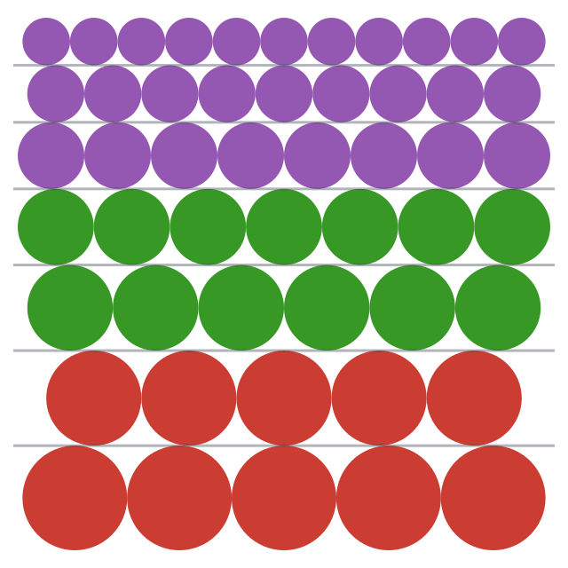

# GEMB.jl: Glacier Energy and Mass Balance Model

[](https://alex-s-gardner.github.io/GEMB.jl/dev/)
[](https://github.com/alex-s-gardner/GEMB.jl/actions/workflows/CI.yml?query=branch%3Amain)

## Overview

GEMB.jl is a Julia implementation of the Glacier Energy and Mass Balance (GEMB, the "B" is silent) model - a comprehensive one-dimensional physical model designed to simulate the surface energy balance and vertical firn evolution of glaciers and ice sheets. It couples atmospheric forcing with subsurface thermodynamics and densification physics to resolve the evolution of temperature, density, water content, and grain properties over time.

GEMB is a column model (no horizontal communication) of intermediate complexity, prioritizing computational efficiency to accommodate the multi-millennial spin-ups required for initializing deep firn columns. It is used for interpreting satellite altimetry data, firn studies, surface mass balance inversion from satellite data, ice core studies, uncertainty quantification and model exploration in cryosphere research. A complete description of version 1.0 of the model is given in [*Gardner et al*., 2023](https://doi.org/10.5194/gmd-16-2277-2023).

GEMB.jl is the reference implementation of GEMB and is developed independently. It began as a translation of an earlier MATLAB version, and since v2.0.0 its physics, defaults, and numerics are set on their own merits — against the published literature and against the two open firn models with a comparable physics surface, the [Community Firn Model](https://github.com/UWGlaciology/CommunityFirnModel) and [IMAU-FDM](https://github.com/IMAU-ice-and-climate/IMAU-FDM). The [MATLAB version](https://github.com/alex-s-gardner/GEMB) is maintained separately and the two are no longer expected to agree numerically; where GEMB.jl's physics differs from an earlier form or from a published law it is recorded under [Physics notes](#physics-notes).

## Key Capabilities

GEMB simulates a wide range of physical processes critical to glacier health:

* **Surface Energy Balance (SEB):** Resolves radiative fluxes (shortwave/longwave) and turbulent heat fluxes (sensible/latent) using Monin-Obukhov similarity theory.
* **Subsurface Thermodynamics:** Solves the heat equation with phase change, meltwater percolation, and refreezing.
* **Firn Densification:** Simulates the compaction of snow into firn and ice using empirical or semi-empirical schemes.
* **Hydrology:** Tracks meltwater retention (irreducible water content), percolation, and refreezing using a "bucket" scheme, with a tunable density-and-thickness impermeability criterion for flow-blocking ice layers. There is no preferential-flow domain, by design — see [Meltwater percolation scheme](https://alex-s-gardner.github.io/GEMB.jl/dev/#Meltwater-percolation-scheme).
* **Dynamic Albedo:** Models albedo evolution with long-term memory, accounting for grain growth and specific surface area.
* **Grid Management:** Utilizes a dynamic Lagrangian-style vertical grid that evolves with accumulation and ablation, automatically merging and splitting layers to maintain numerical stability.

## Installation

GEMB.jl is not yet registered in the Julia General registry. Install directly from GitHub:

```julia
using Pkg
Pkg.add(url="https://github.com/alex-s-gardner/GEMB.jl")
```

## Quick Start

```julia
using GEMB
using GEMB_ClimateForcing  # synthetic/real forcing lives in the companion package

# 1. Initialize model parameters
params = initialize_parameters()

# 2. Create climate forcing (a DimStack) and convert to a ClimateForcing
ds = simulate_climate_forcing("test_1", 3)  # 3-hourly synthetic data
forcing = initialize_forcing(ds)

# 3. Initialize the vertical profile (its grid is sized to the forcing climate)
profile = initialize_profile(params, forcing)

# 4. Run the model
output = gemb(profile, forcing, params)

# 5. Extract surface temperature time series
T_surface = surface_timeseries(output.temperature)
```

`simulate_climate_forcing` (and real-data loaders) live in the companion
[GEMB_ClimateForcing.jl](https://github.com/alex-s-gardner/GEMB_ClimateForcing.jl),
which produces a `DimStack`. GEMB's core `initialize_forcing(::DimStack)` method
converts it into the `ClimateForcing` the model consumes.

## Basic Workflow

Using GEMB requires four basic steps:

1. **Define Climate Forcing:** Use `initialize_forcing()` to create a `ClimateForcing` — either from observed time-series vectors, or from a `DimStack` produced by the companion `GEMB_ClimateForcing.jl` (e.g. `simulate_climate_forcing()` for synthetic test data, or the ERA5-Land loader for real data).

2. **Define Model Parameters:** Use `initialize_parameters()` to set model parameters such as which densification model is used, output frequency, and physics options.

3. **Initialize a Column:** Use `initialize_profile()` to create an initial profile of temperature, density, grid spacing, and other column properties.

4. **Run GEMB:** Pass the profile, climate forcing, and model parameters to the `gemb()` function.

## Examples

The `examples/` directory contains working examples:

* `examples/synthetic_example.jl` - Simple example using synthetic climate forcing
* `examples/era5_example.jl` - Example using ERA5 reanalysis data

## Key Functions

### Initialization
- `initialize_parameters()` - Create model parameters with defaults or overrides
- `initialize_forcing()` - Create a `ClimateForcing`, either from time-series vectors or from a forcing `DimStack`
- `initialize_profile()` - Set up initial vertical profile

### Main Model
- `gemb()` - Main driver function that runs the model
- `gemb_core()` - Single timestep integration
- `gemb_spinup()` - Cycle forcing to reach equilibrium

### Utilities
- `gemb_profile()` - Extract vertical profiles at specific times
- `gemb_interp()` - Interpolate profiles to specific depths
- `forcing_climatology()` - Average a `ClimateForcing` into a one-year climatological cycle (for spinup)
- `surface_timeseries()` - Extract surface values from output arrays
- `dz2z()` - Convert grid spacing to center coordinates

### Climate Data (companion package)

Climate-forcing generation and loading live in the companion
[GEMB_ClimateForcing.jl](https://github.com/alex-s-gardner/GEMB_ClimateForcing.jl),
which produces a `DimStack` for `initialize_forcing`. These are **not** exported
by GEMB.jl:

- `simulate_climate_forcing()` - Generate synthetic forcing data
- `climate_forcing()` - Download ERA5-Land reanalysis data
- `dewpoint_to_vapor_pressure()`, `vapor_pressure_to_relative_humidity()`, `relative_humidity_to_vapor_pressure()` - Humidity conversions
- `fit_air_temperature()`, `fit_precipitation()`, `fit_longwave_irradiance_delta()`, `fit_seasonal_daily_noise()` - Climate fitting functions

## Documentation

Full documentation is available at:
- **Stable:** https://alex-s-gardner.github.io/GEMB.jl/stable/
- **Development:** https://alex-s-gardner.github.io/GEMB.jl/dev/

See also the [CFM](https://alex-s-gardner.github.io/GEMB.jl/dev/cfm_comparison/) and
[IMAU-FDM](https://alex-s-gardner.github.io/GEMB.jl/dev/imau_fdm_comparison/) comparison pages,
which record GEMB's physics read against each of those models.

## Model Parameters

Every option is set through `initialize_parameters()`, which validates each value at
construction. **Defaults are in bold.** Physics defaults follow the two firn-model
intercomparisons — RetMIP (Vandecrux et al., 2020) and FirnMICE (Lundin et al., 2017) — and,
where those are silent, the shipped configurations of the
[Community Firn Model](https://github.com/UWGlaciology/CommunityFirnModel) and
[IMAU-FDM](https://github.com/IMAU-ice-and-climate/IMAU-FDM). Each option's full citation and
rationale is in its `ModelParameters` docstring (`?ModelParameters`).

### Method options

| Parameter | Options | Notes |
|---|---|---|
| `densification_method` | **`:Arthern`**, `:ArthernB`, `:HerronLangway`, `:Barnola1991`, `:Crocus`, `:CrocusPure`, `:GSFC2020`, `:Simonsen2013`, `:Ligtenberg` | Firn compaction law. FirnMICE finds the raw `:Arthern` (k₀=k₁=1) the most accumulation-sensitive of the eight schemes tested; `:Ligtenberg` and `:GSFC2020` are its recalibrated successors and are worth considering for a specific domain |
| `densification_accumulation` | **`:accumulation`**, `:precipitation` | Whether compaction is driven by mean snowfall or by mean total precipitation |
| `thermal_conductivity_method` | **`:Calonne2019`**, `:Calonne2019Air`, `:Calonne`, `:Sturm`, `:Marchenko2019` | RetMIP §5.1 recommends `:Calonne2019` by name; the CFM and IMAU-FDM both ship it. `:Calonne2019Air` carries the air-conductivity ratio of eq. 5 on the snow branch as IMAU-FDM does |
| `thermal_solver` | **`ExplicitThermal()`**, `ImplicitThermal()` | Thermal integration scheme, selected by *type* rather than by `Symbol`. `ExplicitThermal` sub-steps to the Von Neumann stability limit, so its cost is set by the stiffest cell; `ImplicitThermal` is backward Euler on a tridiagonal system, unconditionally stable, and sub-steps only for accuracy. The explicit default is faster on a well-conditioned column (measured 2.4 s vs 5.8 s over a year of 3-hourly forcing) and is what the implicit path is validated against; the implicit path is the robust choice when thin refrozen lenses collapse the stability limit |
| `thermal_explicit_safety_factor` | **`0.8`**, any value in (0, 1] | Fraction of the diffusive stability limit `ExplicitThermal` may sub-step at; unread by `ImplicitThermal`. Not slack against an imprecise limit: `_max_safe_dt` bounds diffusion only, while the surface cell also carries the surface energy balance's feedback `Λ = dQ/dT₁ ≤ 0` in the same coefficient, and nothing in the model bounds `Λ`. Over a year of 3-hourly forcing at the synthetic site the realized surface amplification factor stayed ≤ 0.955 at 0.8 but exceeded 1 on 0.65% of steps at 0.95, for ~17% fewer sub-steps. Raise it toward 1.0 to trade monotonicity margin for speed on a well-conditioned column; use `ImplicitThermal()` if the step limit should be gone rather than loosened |
| `heat_capacity_method` | **`:constant`**, `:CuffeyPaterson` | `:constant` (2102 J kg⁻¹ K⁻¹) matches the CFM's melt-enabled path; `:CuffeyPaterson` is `152.5 + 7.122·T` |
| `rain_heat_capacity` | **`:water`**, `:ice` | Heat capacity carrying rain's sensible heat above the melting point |
| `mean_temperature_method` | **`:arithmetic`**, `:arrhenius` | How the mean annual temperature driving densification is averaged |
| `grain_growth_method` | **`:Arthern`**, `:Marbouty`, `:hybrid` | Dry non-dendritic grain growth. The CFM ships `:Arthern`; `:Marbouty` stops dead at 400 kg m⁻³ |
| `water_irreducible_method` | **`:ColeouLesaffre`**, `:constant` | Both the CFM and IMAU-FDM use Coléou & Lesaffre; RetMIP §5.4 ties the flat 0.07 to under-retention in the percolation zone |
| `melt_geometry` | **`:thickness`**, `:density` | What melting does to a cell: shrink `dz` at fixed density (Crocus) or lower density at fixed `dz` (SNOWPACK). Only `:density` makes a melt–refreeze cycle return the geometry as well as the mass |
| `runoff_method` | **`:instantaneous`**, `:ZuoOerlemans`, `:Darcy` | All three RetMIP bucket lineages and both comparison models run instantaneous. The other two give a drainage timescale and permit firn aquifers |
| `new_snow_method` | **`:Constant350`**, `:Constant315`, `:Constant150`, `:Fausto`, `:FaustoFit`, `:Pahaut`, `:Kaspers`, `:KuipersMunneke` | Fresh-snow density. The CFM ships a constant 350. `:Constant*` are bare constants; `:Fausto`/`:FaustoFit`/`:Pahaut` also select the Crocus wind-dependent fresh-grain properties. `:Pahaut` is the only alpine-seasonal-snow fit — prefer it for temperate and mid-latitude glaciers, where the polar fits run too dense |
| `albedo_method` | **`:GardnerSharp`**, `:BrunLefebre`, `:GreuellKonzelmann`, `:None` | |
| `emissivity_method` | **`:uniform`**, `:grain_radius_threshold`, `:grain_radius_w_threshold` | |
| `initialize_age` | **`:steady_state`**, `:zero` | |
| `output_frequency` | **`:all`**, `:daily`, `:weekly`, `:monthly`, `:last` | |

### Physical and numerical settings

| Parameter | Default | Units | Notes |
|---|---|---|---|
| `density_ice` | **917.0** | kg m⁻³ | Pure-ice density. Matches the CFM and IMAU-FDM, and the pure-ice density the Calonne (2019) conductivity and Barnola (1991) densification fits were built against |
| `water_irreducible_saturation` | **0.07** | – | Read only under `water_irreducible_method = :constant` |
| `impermeable_density` | **830.0** | kg m⁻³ | Flow-blocking criterion (CFM `RhoImp`). RetMIP models span 810–917 |
| `impermeable_thickness` | **0.1** | m | Minimum blocking-lens thickness (CFM `ThickImp`) |
| `pore_saturation_max` | **1.0** | – | Cap on pore filling; only reachable when runoff is delayed |
| `heat_capacity_ice` | **2102.0** | J kg⁻¹ K⁻¹ | Read only under `heat_capacity_method = :constant` |
| `rain_temperature_threshold` | **273.15** | K | Rain/snow partition temperature |
| `emissivity` | **0.97** | – | |
| `emissivity_grain_radius_large` | **0.97** | – | |
| `emissivity_grain_radius_threshold` | **10.0** | mm | |
| `surface_roughness_effective_ratio` | **0.10** | – | |
| `albedo_snow` / `albedo_ice` / `albedo_fixed` | **0.85** / **0.48** / **0.85** | – | |
| `albedo_density_threshold` | **`Inf`** | kg m⁻³ | `Inf` disables the density-based snow/ice albedo switch |
| `cloud_fraction` | **0.1** | – | |
| `shortwave_subsurface_absorption` | **`false`** | – | Absorb shortwave with depth rather than at the surface only |
| `shortwave_downward_diffuse`, `solar_zenith_angle`, `cloud_optical_thickness`, `black_carbon_snow`, `black_carbon_ice` | **0.0** | – | Overridden by the forcing when supplied |
| `column_ztop` | **10.0** | m | Depth of the uniform near-surface zone |
| `column_dztop` | **0.05** | m | Cell thickness in that zone |
| `column_dzmin` / `column_dzmax` | **0.025** / **0.075** | m | Merge/split bands enforcing the fixed cell count |
| `column_depth_max` | **250.0** | m | *Ceiling* on the constructed column depth, not the depth itself |
| `column_zy` | **1.10** | – | Geometric growth ratio below `column_ztop` |
| `horizontal_strain_rate` | **0.0** | yr⁻¹ | Ice-dynamic layer thinning; 0 disables the term |
| `surface_slope` | **0.0** | m m⁻¹ | Hydraulic gradient; read only under `:ZuoOerlemans`/`:Darcy` |
| `output_viscosity` | **`false`** | – | Adds a `viscosity` output layer; populated only under `:Crocus`/`:CrocusPure` |

## Output Structure

GEMB returns a `DimStack` containing labeled arrays with explicit dimensions:
- `Ti` - Time dimension
- `Z` - Vertical (depth) dimension

Output variables include:
- `temperature` - Subsurface temperature (K)
- `density` - Snow/firn/ice density (kg/m³)
- `grain_radius` - Grain size (m)
- `water_content` - Liquid water content (-)
- `dz` - Grid spacing (m)
- Surface fluxes and mass balance components

## Testing

```julia
using Pkg
Pkg.test("GEMB")
```

Tests validate:
- Each physics module against the closed form of the law it implements, and against
  published values or an independent implementation (the CFM, IMAU-FDM) where one exists
- Conservation of mass and energy per timestep, and over a whole run
- Full model integration, spinup convergence, and grid management invariants
- Profile extraction and interpolation
- A full-run numerical fingerprint (`test/test_synthetic_regression.jl`) that catches
  unintended changes to model output; an intended change re-pins it, with the reason and
  the size of the shift recorded in place

The test target needs the companion [GEMB_ClimateForcing.jl](https://github.com/alex-s-gardner/GEMB_ClimateForcing.jl)
checked out as a sibling directory, resolved via `[sources]` in `test/Project.toml`
(Julia ≥ 1.11).

## Performance

GEMB prioritizes computational efficiency to accommodate the multi-millennial spinups that
deep firn columns require, and the hot physics loop is tuned for low allocations and type
stability.

**Benchmark workload** (`bench/opt_bench.jl`): a 75-year climatological spinup followed by a
32-year transient run — **~107 model-years at 3-hourly resolution** — on a single firn
column. Total wall-clock time for the full workflow, measured on an Apple M2 Max as the
minimum of 3 runs after warmup: **5.7 s**.

The first call to any function includes JIT compilation overhead; subsequent calls use
compiled native code, so a single short run is not representative.

`bench/opt_bench.jl` also emits a per-field numerical snapshot (sum/min/max/count), so an
optimization can be checked for bit-level equivalence against a baseline rather than only
for speed.

## Design

- **DimensionalData.jl:** all arrays carry explicit dimension labels (`Ti`, `Z`) rather than
  relying on positional ordering
- **Immutable parameters:** `ModelParameters` is immutable; construct a new instance to change
  a setting
- **Symbols for options:** every method choice is a `Symbol` (see the
  [parameter table](#model-parameters)), validated at construction
- **State as a NamedTuple:** the column state passes between timesteps as a plain NamedTuple
  of vectors, so the hot loop carries no labeled-array overhead
- **Fixed-length vertical grid:** the column holds a constant cell count and a constant total
  depth for the whole run, rather than growing and shrinking as cells are added and removed
  (see below)
- **Conservation checks:** with `verbose=true`, `gemb_core` validates mass and energy
  conservation every timestep

### Physics notes

Places where GEMB.jl's physics departs from an earlier form of the model, or where a
published law needed correction or interpretation. Recorded so the choices are auditable and
are not silently re-litigated. Upstream issue numbers refer to
[the MATLAB implementation](https://github.com/alex-s-gardner/GEMB/issues), where the same
defect exists.

- **Grain metamorphism runs unconditionally**, where MATLAB skips it unless `albedo_method` is
  `:GardnerSharp` or `:BrunLefebre`. That gate is a performance optimization — grains coarsen
  regardless of the albedo scheme — but it covers only two of the four schemes that read
  `grain_radius`: `:ArthernB`/`:Crocus`/`:CrocusPure` densification and the
  `:grain_radius_threshold`/`:grain_radius_w_threshold` emissivity methods read it too, and
  select independently of `albedo_method`. Those configurations ran with `grain_radius` frozen
  at its initial profile, silently. Since `:ArthernB` compaction goes as `1/r²` and grains only
  coarsen, the frozen radius is always too small and compaction always too fast: over 32 years
  of synthetic forcing, final mean column density is 671.5 rather than 877.7 kg m⁻³. Skipping
  the work costs 11% on the runs that can skip it and silently re-breaks whenever a consumer is
  added, so it is simply always done. Defaults are unaffected — grain growth already ran under
  `:GardnerSharp` (upstream [#202](https://github.com/alex-s-gardner/GEMB/issues/202)).
- **`firn_air_content` is metres of air**, `Σ dz (1 − ρ/ρ_ice)`. MATLAB normalizes the same
  mass deficit by 1000 rather than `density_ice`, which yields metres of water equivalent —
  9.0% lower for `density_ice = 910`. Affects the `firn_air_content` output only
  (upstream [#198](https://github.com/alex-s-gardner/GEMB/issues/198)).
- **`:ArthernB` densification is corrected and selectable.** MATLAB omits gravity and the
  per-second-to-per-year conversion from Arthern et al. (2010) eq. B1 — a combined factor of
  ~3.1e8, leaving the scheme inert — and applies the overlying cell's density to the whole
  overlying depth rather than integrating `Σ(ρⱼdzⱼ + waterⱼ)g`. Corrected here and validated
  against the Community Firn Model's `Arthern2010T` to 1e-8. MATLAB marks the scheme
  "DO NOT USE"; it is now a permitted `densification_method`
  (upstream [#200](https://github.com/alex-s-gardner/GEMB/issues/200)). The steady-state
  initial guess falls back to `:Arthern`, which the spinup then relaxes. `:LiZwally` and
  `:Helsen` remain gated.
- **Added `densification_method = :GSFC2020`** — Medley et al. (2022) GSFC-FDM v1.2.1
  eq. 18, the recalibrated successor to `:Arthern`: the same `dρ/dt = c(ρᵢ−ρ)` form with the
  mean accumulation raised to a fitted exponent (α₀ = 0.91, α₁ = 0.644) and a per-stage
  activation energy (59500 and 56870 J mol⁻¹ against Arthern's single 60000). Not present in
  MATLAB. Cross-checked against the Community Firn Model's `GSFC2020` to the 0.102% `g`
  offset. Because α ≠ 1 the accumulation units are load-bearing rather than absorbed into a
  prefactor: `precipitation_mean` is kg m⁻² yr⁻¹, which is the convention the exponents were
  fitted against.
- **Added `densification_method = :Simonsen2013`** — Simonsen et al. (2013), `:Arthern`'s form
  and activation energies retuned for Greenland: a constant factor 0.8 below 550 kg m⁻³, and
  1.25·γ above with `γ = 61.7/√A · exp(−3800/RT̄)`, where γ scales the second stage only. Not
  present in MATLAB. The form follows Lundin et al. (2017) FirnMICE eqs. A36–A37; that paper
  publishes no numeric tuning scalars, so the values 0.8 and 1.25 are the Community Firn
  Model's, against which the implementation is cross-checked to the 0.102% `g` offset. As for
  `:GSFC2020`, the accumulation units are load-bearing (`γ ∝ A^−1/2`): `precipitation_mean` is
  kg m⁻² yr⁻¹.
- **Added `densification_method = :Crocus` and `:CrocusPure`** — viscous settling of Vionnet
  et al. (2012) eqs. 5–9, `dD/D = −σ/η·dt` with `η = f1·f2·η₀(ρ/cη)·exp(aη(T_fus−T) + bη·ρ)`.
  Not present in MATLAB, and the only scheme in which liquid water affects densification:
  `f1 = (1 + 60·W_liq/(ρ_w·D))⁻¹` reduces viscosity by up to ~61× in wet cells, `f2 =
  min(4, exp(min(0.4 mm, gs−0.2 mm)/0.1 mm))` raises it for coarse angular grains. Overburden
  is the same `Σ(ρdz + water)·g` integral `:ArthernB` uses, taken at the cell midpoint (the
  paper's half-own-weight rule for the surface layer, applied uniformly). Integrated as
  `D·exp(−σ/η·dt)`, eq. 5's exact solution at constant σ and η, rather than through the
  `c(ρᵢ−ρ)` relaxation the other schemes share. Cross-checked against the Community Firn
  Model's `Crocus`, which differs in hardcoding `f2 = 4` and adopting van Kampenhout et al.
  (2017)'s retuned `cη = 358`; the paper's `f2` and `cη = 250` are used. Two departures from
  the published law: `f2` is floored at 1 (eq. 9 is bounded above but not below, so it
  *softens* fine-grained snow — 0.368, a 2.7× speedup, at GEMB's 0.05 mm fresh-snow radius.
  Crocus never reaches that regime because eq. 9 applies only to non-dendritic snow, whose
  `gs` the paper puts at 0.3–0.4 mm where eq. 9 gives 2.7–4; GEMB carries one grain radius
  for both regimes, so the floor keeps `f2` a stiffening correction across the domain eq. 9
  actually covers and inert below it), and `:Crocus` hands cells at or above 450 kg m⁻³
  to `:GSFC2020`. That handover exists because eq. 7 is fitted to a 1–2 m alpine snowpack and
  `exp(bη·ρ)` saturates in firn: the unblended law gives 0.7–0.8× `:Arthern`'s compaction
  rate in the top few metres but only 0.02–0.09× below 20 m. 450 kg m⁻³ is the threshold the
  Community Firn Model uses for the same purpose; the handover is a branch, not a weighted
  blend, since neither paper prescribes a blending function. `:CrocusPure` applies eq. 5 at
  every density.
- **Added `densification_method = :Barnola1991`** — Herron & Langway (1980) stage 1 below
  550 kg m⁻³, Barnola et al. (1991) pressure sintering above:
  `dρ/dt = ρ·A₀·exp(−Q/RT)·f(ρ)·σ³` (Tellus 43B, 83–90, eq. 2) with `A₀ = 2.54e4 MPa⁻³ s⁻¹`
  converted to Pa⁻³ s⁻¹, `Q = 60 kJ mol⁻¹`.
  Not present in MATLAB. The only scheme here that treats the firn–ice transition
  mechanistically rather than extrapolating a snow/firn fit: `f(ρ)` is a polynomial fitted to
  Pimienta and Duval (1987) below 800 kg m⁻³ and the analytic isolated-spherical-pore form
  `(3/16)(1−ρ/ρᵢ)/(1−(1−ρ/ρᵢ)^⅓)³` above, which vanishes with porosity, so the law
  self-limits as ρ → ρᵢ instead of being driven to zero by a `(ρᵢ−ρ)` factor. That
  self-limiting holds only while the closed-pore branch is reached at all: the 800 kg m⁻³
  handover is absolute while the polynomial carries no `ρᵢ`, so `:Barnola1991` requires
  `density_ice >= 900` (enforced in `validate_parameters`), against `[800, 950]` elsewhere.
  Overburden is
  the same `Σ(ρdz + water)·g` integral `:ArthernB` uses, at the cell midpoint as for
  `:Crocus`. Integrated with forward Euler on `dρ/dt`. Stage 1 is bit-for-bit
  `:HerronLangway`, sharing one kernel; the steady-state initial guess falls back to
  `:HerronLangway`, exact below 550 and approximate above. Cross-checked against the
  Community Firn Model's `Barnola1991`, which agrees on both branches and all four
  polynomial coefficients. `n = 3` throughout, as in the paper, whose `A₀` was fitted against
  it over 0.55–0.8 g cm⁻³; the paper's `n = 1` remark scopes itself to bulk ice below
  close-off (Pimienta and Duval 1987 torsion-tested 0.85 g cm⁻³ ice and report no
  densification rate), so it is not an unimplemented firn branch. Two departures, both
  documented in `calculate_density.jl`: (i) the paper's ΔP is overburden *minus bubble
  pressure*; only the overburden is applied, so effective stress is overstated above
  830 kg m⁻³ where pores close. This paper gives no expression for the bubble term; Goujon et
  al. (2003) eqs. A11–A12 do, so it belongs in a separate scheme rather than as a patch here.
  (ii) only the closed-pore branch scales with `density_ice`, and the branches meet in value
  at ρᵢ = 919.96 and in slope at 920.06 against the paper's stated C¹ matching, so the fit
  assumes ρᵢ ≈ 920 and at GEMB's default 910 the rate steps down 14% crossing 800 kg m⁻³ (a
  discontinuity in `dρ/dt`, not in ρ). The 550 kg m⁻³ handover is also a rate discontinuity, by
  construction in the paper: it joins a depth-independent accumulation-driven rate to a σ³ one,
  so on a 250 K, 300 kg m⁻² yr⁻¹ column sintering is ~1.3e4× slower than Herron–Langway just
  above 550 at 1 m depth and overtakes it only near 13 m. Calibrated over −14 to −57 °C and
  2.2–65 g cm⁻² yr⁻¹; no liquid-water term.
- **`water_irreducible_saturation` now applies during percolation.** MATLAB declares a local
  `0.07` that overrides the documented parameter at every percolation retention site; only
  the pre-percolation squeeze read the parameter. Changes output wherever
  `water_irreducible_saturation != 0.07` (upstream
  [#199](https://github.com/alex-s-gardner/GEMB/issues/199)).
- **Added `water_irreducible_method = :ColeouLesaffre`** — density-dependent irreducible
  saturation, `S_wi = wmi/(1−wmi)·ρᵢρ/(ρ_w(ρᵢ−ρ))` with `wmi = 0.057(ρᵢ−ρ)/ρ + 0.017`
  (Coléou and Lesaffre 1998 eq. 3 via Langen et al. 2017 eq. 4), matching the Community Firn
  Model, and the default since v2.0.0 — it is what both the CFM and IMAU-FDM ship, and
  RetMIP Sect. 5.4 attributes part of the multi-model under-retention in the percolation zone
  to the flat 0.07. Retention is zero at and above pore close-off, as in CFM. `:constant`
  remains available and holds `water_irreducible_saturation` at every density.
- **Added `melt_geometry`** — what melting does to a cell's geometry. `:thickness` (the
  default, and what GEMB has always done, as in Crocus) holds density fixed and shrinks `dz`;
  `:density` holds `dz` fixed and lowers density, as SNOWPACK does and as Fourteau et al.
  (2026) Sect. 2.3 argues for, on the grounds that the phase change occurs within the
  microstructure and that the high density of wet snow is better explained by its low
  viscosity under overburden. Refreezing is at constant thickness under both, so only
  `:density` returns a cell's geometry along with its mass over a melt–refreeze cycle.
  Affects melting cells' `dz` and `density`, and through the irreducible-retention capacity
  their water and runoff. Defaults leave output unchanged.
- **The implicit thermal solver's surface-row Newton iteration is damped.** The step weight is
  halved whenever a step fails to shrink, and the least-residual iterate is retained if the
  iteration cap is reached. Measured over a year of 3-hourly synthetic forcing (3.77M sub-step
  solves), 39% of solves previously reached the cap without converging, in limit cycles of
  ~0.02 K median amplitude straddling the latent-heat switch at 273.15 K rather than in
  divergence; damping cuts that to 0.9% at no measurable runtime cost. Affects
  `thermal_solver = ImplicitThermal()` only (−0.02% melt on the benchmark run);
  `ExplicitThermal` and converging solves are bit-identical.
- **Added `impermeable_density` and `impermeable_thickness`**, exposing the bucket scheme's
  density-based impermeability criterion, which MATLAB hardcodes as `830` kg m⁻³ and `0.1` m in
  `calculate_melt`. Water is routed to runoff at a contiguous run of cells at or above
  `impermeable_density` thicker than `impermeable_thickness`. RetMIP (Vandecrux et al. 2020)
  recommends bucket schemes adopt such a criterion and shows model spread at ice-slab sites is
  dominated by this pair: the density threshold spans 810 kg m⁻³ (DMIHH, after Gregory et al.
  2014, which gave the lowest firn-temperature RMSE at KAN_U) to 917 (DTU, whose runoff was
  unrealistic enough to be excluded from the paper's multi-model mean). The `:ColeouLesaffre`
  gate stays on the constant `DENSITY_PORE_CLOSEOFF` — where capillary retention ceases for
  want of connected pore space is a different question from where a lens stops conducting flow
  — so lowering the flow criterion does not silently change retention. Defaults reproduce
  MATLAB bit-identically.
- **Added percolation-depth, ice-slab, and depth-limited firn-air-content diagnostics**
  (`percolation_depth`, `ice_slab_thickness`, `ice_slab_depth`, `firn_air_content_10m`,
  `firn_air_content_20m`), the quantities RetMIP evaluates models against — upward-looking
  radar wetting-front depth (Heilig et al. 2018), firn-core slab observations, and published
  FAC (Vandecrux et al. 2019), which is reported to a fixed depth rather than whole-column.
  `percolation_depth` is an interval maximum, matching what radar measures; the slab terms are
  instantaneous, so `ice_slab_depth = NaN` ("no slab") cannot poison an interval mean, and are
  scanned after the grid controllers run, so recomputing slab depth from the output `dz` and
  `density` reproduces them. All are read-only and take no part in the mass or energy budget,
  so output is unchanged.
- **Added `heat_capacity_method = :CuffeyPaterson`** — temperature-dependent specific heat,
  `c_p(T) = 152.5 + 7.122 T` (Cuffey and Paterson 2010 eq. 9.1). MATLAB uses the constant
  2102 J kg⁻¹ K⁻¹, its value at the melting point, which overstates the cold content of firn
  at 240 K by 12.9% and at 210 K by 27.5%. The default is `:constant`, matching what the CFM
  ships on its melt-enabled path (`c_firn = CP_I`).
- **Internal energy is the enthalpy integral `∫c_p dT`, not `M·T·c_p`.** The latter is valid
  only for constant `c_p`; under `:CuffeyPaterson` it overstates enthalpy by `(b/2)T²`, which
  is 0.79·`LF` at the melting point. Cell mixing, the thermal solver, and every energy budget
  now work in enthalpy. For the default `:constant` the two forms are algebraically identical,
  so the change is arithmetic reordering (~1e-13 per operation); the 75-cycle spinup is not
  converged and amplifies this to ~0.3% in melt-related whole-run totals, so the synthetic
  regression pins were re-centered. Absolute column enthalpy is not comparable between the two
  methods (574 061 vs 307 385 J kg⁻¹ at 273.15 K), so reported thermal energy shifts when
  switching. The enthalpy solver costs ~17% more wall-clock than the constant-`c_p` form it
  replaced (4.9 s to 5.7 s on the 107-model-year benchmark); allocations fell.
- **Spinup convergence is judged on the mass-weighted mean density of the whole column**, not
  on a cubic-spline depth average over a separate `convergence_depth` (removed, along with its
  half-the-column default). The column depth is now fixed for the run, so the full column is
  the same domain at every cycle and the mean is exact without interpolation. Shifts the cycle
  at which a spinup exits — the synthetic example converges at 48 cycles rather than 63,
  changing whole-run totals by ~0.3% — but not the physics of any cycle. MATLAB has no
  equivalent criterion.
- **Added `convergence_drift_density`**, a trend-based spinup exit test: the least-squares slope
  of column-mean density against cycle over the trailing `drift_window` cycles (default 10),
  in kg m⁻³ per cycle. Where `convergence_delta_density` bounds the step between consecutive
  cycles — which a column creeping steadily at just under the tolerance passes while still
  densifying — this bounds the trend. When both are given both must hold. Not present in
  MATLAB; off by default, so it changes no existing run.
- **No initialized cell starts above the melt point.** `initialize_profile` clamps the
  temperature it fills to 273.15 K, with a warning. The climate-derived path was already
  clamped in `_steady_state_temperature`; this extends the ceiling to the two
  MATLAB-fidelity flags (`constant_temperature`, and both flags together), which filled
  `temperature_air_mean` verbatim as MATLAB's `model_initialize_profile` does. Affects only
  sites whose mean annual air temperature is above freezing, where the old column began as
  ice above its melting point holding no water — enthalpy the column has no state to carry.
- **Added an `age` profile variable** — the mass-weighted mean age, in decimal days, of all
  mass in a cell (ice/firn matrix plus pore water), measured from column initialization.
  MATLAB GEMB has no age variable. Snowfall, rain and vapour deposition enter at age 0;
  proportional mass removal (melt, sublimation, runoff, basal trim under accumulation,
  horizontal strain) is age-neutral; merges mass-weight it and splits duplicate it.
  Meltwater carries the age of the firn it melted from and mass-weights that age into the cell
  where it refreezes, so a heavy melt year does not read as artificially young firn at depth.
  Age accumulates across `gemb_spinup` cycles, so for a spun-up run the epoch is the start of
  spinup. It is new state only: no physics reads it, and it moves no mass and carries no
  energy, so the mass and energy budgets are unchanged and the synthetic regression pins are
  unmoved. Under sustained ablation the deepest cell's age is a lower bound, basal accretion
  inheriting that cell's own age — the same treatment `density` and `temperature` already get
  at that site.
- **Densification is driven by mean snowfall, not mean precipitation.** Every
  accumulation-driven scheme (`:Arthern`, `:Ligtenberg`, `:Simonsen2013`, `:GSFC2020`,
  `:HerronLangway`, `:Crocus`, and `:Barnola1991` below its stage transition) compacted
  against `precipitation_mean`, which includes rain. Rain does not bury the column, so the
  burial rate — and therefore compaction — was overstated at any raining site. A new
  `accumulation_mean` forcing scalar partitions precipitation on
  `rain_temperature_threshold`, the same split `initialize_climate_summary` already applied,
  so the transient run and the initializer now use the same accumulation flux instead of
  disagreeing. Reduces densification; on the synthetic site (3.2% rain) the 32-year final mean
  column density falls by ~1.1 kg m⁻³. Set `densification_accumulation = :precipitation` to
  restore the previous behaviour bit-for-bit.
- **Rain's sensible heat is carried at the water heat capacity.** Rain above the melting
  point entered through `mix_temperature_liquid` with its sensible heat evaluated at
  `heat_capacity_ice` (2102 J kg⁻¹ K⁻¹) rather than ~4220, understating it by about 2×. The
  new `specific_enthalpy_water(mp, T)` form is used on both sides of the budget, including
  the `verbose` energy check, which previously used the same wrong convention on both sides
  and so could not catch it. Adds energy at raining sites: on the synthetic site melt rises
  48.7 kg m⁻² (+0.43%) over 32 years. Pore water is unaffected — it is pinned at the melting
  point, where the one-argument form still applies exactly. Set
  `rain_heat_capacity = :ice` to restore the previous behaviour bit-for-bit.
- **An initialized column carries the age its steady-state profile implies.** `age` was set
  to zero on every initialization path, even though `steady_state_profile` already integrated
  a residence time along the march that temperature, density and all three grain variables
  are initialized from. Any age or residence-time diagnostic was therefore meaningless until
  a multi-century spinup had flushed the column. The marched age is now used, and a new
  `close_off_age` output reports the age at the shallowest cell reaching pore close-off
  (830 kg m⁻³), `NaN` for an open column. Output-only: no physics reads `age`, so budgets and
  the regression pins are unmoved. Set `initialize_age = :zero` to restore zeros. The
  `constant_density` escape hatch forces `:zero` regardless, since it discards the march's
  density and the marched age describes a firn column that flag replaces with solid ice.
- **Optional Arthern (2010) dry-snow grain growth.** Grain growth ran only the seasonal-snow
  parameterizations, whose Marbouty density factor is identically zero above 400 kg m⁻³ — so
  `grain_radius` was frozen throughout the firn column, which matters because `:ArthernB`
  densification goes as `1/r²`. `grain_growth_method = :Arthern` integrates
  `dr²/dt = k_gr·exp(-E_g/RT)` instead, and `:hybrid` keeps Marbouty's temperature-gradient
  physics in seasonal snow and hands over to Arthern at 400 kg m⁻³. Default remains
  `:Marbouty` (bit-identical); `:hybrid` is the physically defensible setting for deep firn.
- **`heat_flux_basal` and an optional `viscosity` profile are now reported.** Both were
  already computed and discarded. `heat_flux_basal` is the conductive flux across the deepest
  interior face — an output of the Dirichlet lower boundary, not a prescribed geothermal flux,
  hence the name — previously visible only inside the `verbose` energy check. `viscosity`
  [Pa s] is added as a profile layer under `output_viscosity = true`, populated by the
  `:Crocus`/`:CrocusPure` settling law and `NaN` under every other scheme, which form no
  effective viscosity. Diagnostic only; no physics reads either.

### Fixed-length vertical grid

MATLAB GEMB lets the column length float: cells are pushed and popped as snow accumulates,
melts out, splits, and merges. GEMB.jl pins both the cell count and the total column depth via
two independent controllers — count is restored by exactly conservative merge/split operations
at depth, and depth by a continuous signed adjustment to the bottom cell, the model's only
basal mass and energy flux. Mass and energy are conserved throughout (checked every timestep
under `verbose=true`; the whole-run budget closes to ~1e-11 kg m⁻²).

What this changes for consumers of the output:

- **Profile arrays are sized exactly to the column** and are **top-justified** — the surface
  is always row 1. They were previously overpadded (default 1000 extra rows) and
  bottom-justified, so the surface row moved between timesteps and validity had to be
  recovered by scanning for `NaN`. Neither is needed now; `valid_profile_length` is retained
  and constant.
- **`output_padding` and `column_zmin` are removed**, and `column_zmax` is renamed
  **`column_depth_max`** — padding is obsolete, and the column depth is now pinned exactly
  (to the depth `initialize_profile` derives from the climate, capped by `column_depth_max`)
  rather than banded within `[column_zmin, column_zmax]`.
- **`albedo_method = :Bougamont2005` is removed, and albedo is no longer carried state.** It
  was the only prognostic (time-decay) albedo scheme; the four remaining methods (`:None`,
  `:GardnerSharp`, `:BrunLefebre`, `:GreuellKonzelmann`) are all diagnostic functions of the
  current column, so `calculate_albedo` returns two scalars instead of overwriting per-cell
  vectors, and the parameters `albedo_wet_snow_t0`, `albedo_dry_snow_t0`, and `albedo_K` are
  gone. The per-layer `albedo` and `albedo_diffuse` profile outputs are removed, and the
  surface time series `albedo_surface` is renamed **`albedo_broadband`**; it is now recorded
  from the value used in that timestep's shortwave balance rather than from the post-
  accumulation column, so it differs slightly from the old series on snowfall steps. Output
  under the four remaining methods is otherwise unchanged.
- **`thickness_cumulative` carries a real basal flux**, signed: mass leaves through the base
  under accumulation and enters under ablation. Read it as basal flux, not as glacier
  thickness change — the column is an Eulerian window on the firn, not a prognostic
  ice-thickness model. For thickness change, use the surface terms
  (`precipitation - runoff + evaporation_condensation`).
- **Added `horizontal_strain_rate`** [yr⁻¹, default `0.0`], the trace of the horizontal
  strain-rate tensor `ε̇_xx + ε̇_yy`. By incompressibility it thins (positive, divergence) or
  thickens (negative, convergence) every cell at constant density by `exp(-D·dt)`; the mass
  it exports leaves laterally and is reported as the new `strain_thinning` output and in the
  mass budget, separately from the basal flux. MATLAB has no ice-dynamic term; at the default
  the two agree exactly.
- **Added `runoff_method` and `surface_slope`**, replacing instantaneous runoff with a
  selectable lateral drainage timescale. MATLAB routes all blocked water to runoff within the
  timestep. Under `:ZuoOerlemans` the drained fraction is `min(1, Δt/τ)` with
  `τ = c₁ + c₂·exp(−c₃·S)`, `c₁ = 0.33 d`, `c₂ = 25 d`, `c₃ = 140` (Zuo and Oerlemans 1996
  eqs. 21–22, coefficients via Lefebre et al. 2003 / Langen et al. 2017); under `:Darcy` it is
  `min(excess, ρ_w·Δt·K_sat·K_rel·S)` with `K_sat` from Calonne et al. (2012) eq. 6 and `K_rel`
  from van Genuchten (1980) with the Yamaguchi et al. (2012) parameterization. These are the
  schemes used by the two RetMIP models with the lowest firn-temperature error at the ice-slab
  site KAN_U (DMIHH −1.6 °C, GEUS +0.6 °C, against a spread reaching +4.7 °C). The Community
  Firn Model's `runoffZuoOerlemans` uses `c₁ = 1.5 d` rather than 0.33 while citing the same
  source; the two published lineages disagree on this coefficient and GEMB follows Langen et
  al., the DMIHH lineage RetMIP evaluated. The difference is immaterial at ice-sheet slopes
  (21 d either way at `S = 0.01`). The default is `:instantaneous`, which all three RetMIP
  bucket-scheme lineages and both comparison models use.
- **Water may exceed irreducible saturation when runoff is delayed.** MATLAB clamps pore water
  to irreducible at every retention site, so a saturated cell cannot exist and firn aquifers
  are structurally unrepresentable (RetMIP Sect. 5.4 dropped their aquifer site from the
  retention evaluation for this reason). When `runoff_method !== :instantaneous`, water blocked
  at a barrier or the column base instead backs up into the pore space above it, filling each
  cell to `pore_saturation_max` of its capacity from the barrier upward; only what reaches past
  the surface cell runs off. Cells at or above `impermeable_density` are skipped as having no
  connected pore space. The upward pass does not refreeze — those cells' cold content was
  consumed during percolation — and a cold cell left holding liquid is resolved by the existing
  refreeze-pore-water step on the next timestep. Unreachable at the `:instantaneous` default.
- **Added `aquifer_thickness` and `aquifer_depth` diagnostics** — total thickness of cells
  holding standing (super-irreducible) water, and the depth to the water table, the quantity
  RetMIP evaluates aquifer representation against. Instantaneous, like the ice-slab terms, so
  `aquifer_depth = NaN` ("no standing water") cannot poison an interval mean. Detection is
  thresholded at `AQUIFER_TOLERANCE`, 1e-3 of a cell's pore space, rather than at the physics
  tolerance: `calculate_melt` leaves a retaining cell at exactly irreducible, but
  `calculate_density` then compacts it within the same timestep, shrinking the pore space
  retention was computed against and leaving a genuine ~1e-7-of-pore-space excess that
  accumulates between melt events. Read-only and absent from the mass and energy budgets, so
  output is unchanged.
- **Added `thermal_conductivity_method = :Calonne2019` and `:Marchenko2019`**, both named in
  RetMIP's recommendations. `:Calonne2019` is Calonne et al. (2019) eq. 5, a sigmoid blend at
  ρ = 450 kg m⁻³ between the Calonne 2011 snow quadratic and a firn branch, scaled by the
  temperature-dependent conductivity of ice; it is continuous into ice by construction and so
  is deliberately not short-circuited at `density_ice`. The `917` in its firn branch is the
  paper's fitted pure-ice density, not `mp.density_ice`. `:Marchenko2019` is their eq. 30,
  `k = 0.301e-2ρ − 0.724`, fitted over ρ = 350–900 and floored at the Calonne 2011 value below
  their crossing near ρ = 321, where the bare fit heads negative. Both are higher than
  `:Sturm`/`:Calonne` in firn, the direction RetMIP's cold bias at Summit and Dye-2 implies.
  `:Calonne2019` is the default since v2.0.0: RetMIP Sect. 5.1 recommends it by name, and it is
  what both the CFM and IMAU-FDM ship.
- **The thermal sub-step now comes from the stability limit of the scheme actually being
  solved.** The explicit solve is stable when each cell's own-temperature coefficient stays
  non-negative, i.e. `dt ≤ ρᵢcᵢdzᵢ/(Gᵢ + Gᵢ₋₁)`, where `Gᵢ` is the harmonic-mean face
  conductance `1/(dz[i+1]/2K[i+1] + dz[i]/2K[i])` the flux loop already uses; the Dirichlet
  bottom cell is excluded, since its enthalpy is never updated. This replaced the textbook
  uniform-grid form `0.5·ρᵢcᵢdzᵢ²/Kᵢ`, which substitutes `2Kᵢ/dzᵢ` for `Gᵢ + Gᵢ₋₁`. The two
  agree exactly when `dz` and `K` are uniform, but GEMB's grid is graded, and there the
  substitution errs in *both* directions: `Gᵢ + Gᵢ₋₁` ranges over `(0, 4Kᵢ/dzᵢ]`, so the old
  form could overestimate the true limit by up to 2×, beyond what the 0.8 safety factor
  absorbs. Measured per cell on GEMB's own column the ratio spanned 0.66 to 1.82. No run
  tested was actually unstable — the cell that *binds* the minimum is always one where the old
  form errs low — so this removes a latent unsoundness rather than fixing an observed failure,
  and because it errs low at the binding cell the correct limit is also cheaper. The worst
  cell's coefficient is now exactly `1 − 0.8 = 0.2` in every configuration tested, where the
  old form left an unpredictable 0.22–0.28. Mean sub-steps per timestep fall 40.6 → 29.4 and
  whole-run cost 8.83 s → 7.91 s (1.12×) on the synthetic benchmark. Not selectable: the old
  form is removed, not retained as an option. Output moves — melt sum shifts by 0.34% over 32
  years of synthetic forcing.
- **The unstable-branch integrated stability functions are corrected.** Paulson's (1970) closed
  forms take the *inverse* profile function as their argument, so the exponents are positive:
  `x_m = (1 − 19ζ)^¼` inverts Högström's (1988) `φ_m = (1 − 19ζ)^−¼`, and likewise
  `x_h = (1 − 11.6ζ)^½`. Both were previously evaluated with the exponent of `φ` itself, and
  `Ψ_h` additionally carried Högström's `0.95` `κ_H/κ_M` ratio inside the integral and took
  `x_h` to the second power. Since `Ψ(ζ) = ∫₀^ζ (1 − φ)/z dz` must vanish at neutral, the `0.95`
  put `Ψ_h(0) = −0.0999` rather than 0, leaving the turbulent fluxes discontinuous exactly where
  `T_surface` crosses `T_air` — the crossing the implicit solver's Newton iteration converges
  onto, and where a jump can leave the surface energy balance with no solution in `T_surface`
  (Fourteau et al., 2024, *Geosci. Model Dev.* 17, 1903–1929, Appendix D, who move their own
  branch point to `Ri_b = 0` for this reason). The ratio belongs to the neutral transfer
  coefficient, not inside the integral. Both branches — this one and the stable Beljaars &
  Holtslag (1991) eqs. 28 and 32, which was already correct — are now checked against the
  definition directly, by numerically integrating their own published `φ` and comparing to the
  closed form, agreeing to 6 decimal places at `ζ = ±0.01, ±0.1, ±1, ±5`. Not selectable: the
  old form was wrong, not a variant. Output moves, in the direction the correction implies: the
  corrected `Ψ` is larger, so `coef = log(z/z₀) − Ψ` shrinks and unstable-side exchange
  strengthens, giving more turbulent cooling and more sublimation at a melting surface. Over 32
  years of synthetic forcing melt falls 5.3% and runoff 6.0%.
- **Added `new_snow_method = :Pahaut`** — `max(50, 109 + 6·(T_air − CtoK) + 26·√U)`, Pahaut
  (1975) as implemented in Crocus, via Lafaysse et al. (2026) eq. 35 (SURFEX/Crocus v3.0.2,
  their `:V12` option). Not present in MATLAB. The only fresh-snow option here fitted to
  *alpine seasonal snow* rather than to a polar ice sheet, and the only one carrying a wind
  dependence at the instantaneous timestep — both dependencies physical: warmer snowfall gives
  denser crystals, and wind fragments them before and during deposition. It is much lighter
  than the polar fits over their common range (at −10 °C and 5 m s⁻¹, 107 kg m⁻³ against
  `:FaustoFit`'s 334), because alpine snowfall is warmer, wetter, and far less wind-packed than
  the katabatic-scoured surfaces the Greenland and Antarctic fits were regressed on. Prefer it
  for temperate and mid-latitude glaciers, where the polar fits overestimate fresh-snow
  density, suppressing the albedo of new snow and speeding its burial. The published 50 kg m⁻³
  floor is retained; it binds below about −10 °C in calm air. Like `:Fausto`/`:FaustoFit` it
  also selects the Crocus wind-dependent fresh-grain properties, those being what Crocus itself
  pairs this density with. Opt-in: the `:Constant350` default is unchanged and every existing
  run is bit-identical. `fresh_snow_density` gained a sixth argument (instantaneous wind speed)
  for it, defaulting to the climatological mean so the steady-state initial guess is unaffected.
- **`ζ` is bounded below by −100 on the unstable branch.** A numerical guard on the bulk
  formulation, not a change to the physics: `ζ` is diagnosed from the bulk Richardson number,
  which carries `wind_speed⁻²`, so at the `min_wind_speed = 0.01 m s⁻¹` floor over a melting
  surface under very cold air the synthetic forcing reaches `ζ ≈ −4.9e5`. That is the wind floor
  showing through rather than a stability regime, and Monin-Obukhov theory has no observational
  support anywhere near it (Högström's fits span `|ζ| ≲ 2`). Because the corrected `Ψ` grows
  without bound where the previous incorrect form happened to saturate, an unbounded `ζ` drives
  `Ψ_h` past `log(z_T/z_Q)`, so `coefHT` crosses zero and the flux diverges and then changes
  sign. −100 is two orders of magnitude beyond the calibration range, so it never binds in
  physically meaningful conditions, and it keeps the transfer coefficients positive for every
  roughness GEMB uses. Bounding `ζ` rather than clamping the coefficients keeps the fluxes a
  continuous, monotone function of `T_surface`, which the implicit solver needs.

## Prerequisites

GEMB.jl requires Julia ≥ 1.11. Its dependencies (DimensionalData.jl,
DataInterpolations.jl, FillArrays.jl, JSON.jl, and the `Statistics` and `Dates` standard
libraries) install automatically.

Optional:
- A Makie backend (CairoMakie, GLMakie, or WGLMakie) to enable `gemb_plot_output`
- [GEMB_ClimateForcing.jl](https://github.com/alex-s-gardner/GEMB_ClimateForcing.jl) for
  real (ERA5-Land) or synthetic climate forcing — also required to run the test suite

## Citation

If you use GEMB.jl in your research, please cite:

Gardner, A. S., Schlegel, N.-J., and Larour, E.: Glacier Energy and Mass Balance (GEMB): a model of firn processes for cryosphere research, Geosci. Model Dev., 16, 2277–2302, [https://doi.org/10.5194/gmd-16-2277-2023](https://doi.org/10.5194/gmd-16-2277-2023), 2023.

## Related Repositories

GEMB:

- [GEMB_ClimateForcing.jl](https://github.com/alex-s-gardner/GEMB_ClimateForcing.jl) —
  climate forcing for GEMB: real data (ERA5-Land, via CDS) and synthetic forcing, produced as
  a `DimStack`
- [GEMB_GlacierSims.jl](https://github.com/alex-s-gardner/GEMB_GlacierSims.jl) — multi-site
  and regional GEMB simulation workflows
- [GEMB (MATLAB)](https://github.com/alex-s-gardner/GEMB) — the separately maintained MATLAB
  implementation
- [GEMB.jl documentation](https://alex-s-gardner.github.io/GEMB.jl/)

Other open firn models, both used as independent cross-checks on GEMB's physics (see the
[CFM](https://alex-s-gardner.github.io/GEMB.jl/dev/cfm_comparison/) and
[IMAU-FDM](https://alex-s-gardner.github.io/GEMB.jl/dev/imau_fdm_comparison/) comparison
pages):

- [Community Firn Model](https://github.com/UWGlaciology/CommunityFirnModel) — CFM, the
  University of Washington modular firn model (Stevens et al., 2020)
- [IMAU-FDM](https://github.com/IMAU-ice-and-climate/IMAU-FDM) — the Utrecht firn
  densification model (Ligtenberg et al., 2011; Brils et al., 2022)

## Contributing

Contributions are welcome! Please:
1. Justify any change to the physics against the literature or against an independent
   implementation, and record it under [Physics notes](#physics-notes) if it moves model
   output
2. Add tests that pin the new behaviour — against a closed form, a published value, or an
   independent implementation, whichever applies
3. Follow Julia style guidelines
4. Update documentation for new features

## License

See LICENSE file for details.

## Authors

GEMB was created by Alex Gardner, with contributions from Nicole-Jeanne Schlegel and Chad Greene. The Julia translation was developed by Alex Gardner.

For questions or issues, please open an issue on GitHub.
